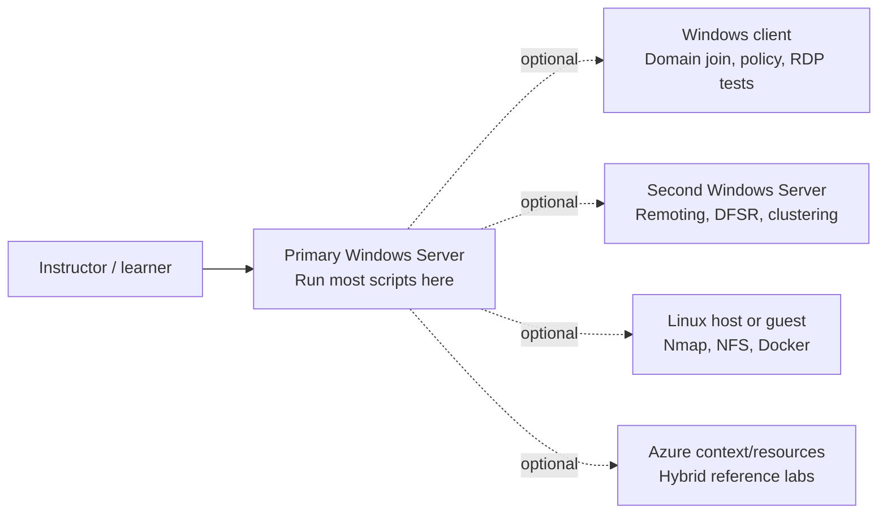
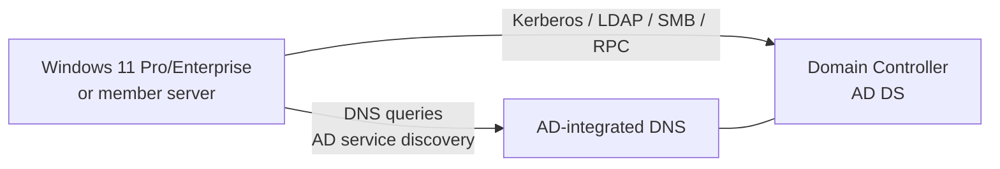

# Lab topology and runtime model

The scripts are **single-server first**. The Windows Server where you run the repository is the primary execution environment. Its hostname, domain membership, active adapter and installed roles are runtime facts.

Names such as `AZ802-WIN01` and `AZ802-LINUX01` are disposable course object names. They are not assumptions that those machines already exist.

## Default and optional machines

One server is enough for many exercises. Cross-host topics are intentionally optional and return `[SKIP]` when the needed second machine is not configured.

## Active Directory client path

For a domain-join exercise, the client needs private network reachability to the domain controller and must use the AD DNS service.

A client that points only to a public DNS resolver may still browse the Internet, but it will not discover a private AD domain correctly.

## Local configuration

Optional capabilities can be recorded in `config/LabConfig.psd1`:

- `PeerWindowsHost` is a second Windows Server for remoting, DFS Replication or clustering;
- `WindowsClient` is an optional client for domain join, DHCP/RDP observations and cross-host checks;
- `LinuxHost` is an optional Linux machine or Hyper-V guest for Nmap/NFS/Docker work;
- `WindowsServerIso` and `LinuxIso` are local media paths;
- `BackupTarget` is an optional backup destination.

If an optional capability is absent, the related script should return `[SKIP]` rather than inventing a hostname or treating the missing machine as a failure.

The fresh-forest example domain is `shayawn.local`, but existing domain state wins. Scripts that work inside Active Directory derive the real distinguished name from `Get-ADDomain` instead of hardcoding `DC=shayawn,DC=local`.

## Azure network note

Azure network security and the guest OS firewall are separate layers. An NSG allow rule does not change Windows Firewall, and a Windows Firewall rule does not change the NSG. For AD labs, keep directory traffic on private VNet/VPN paths rather than exposing AD services to the public Internet.
